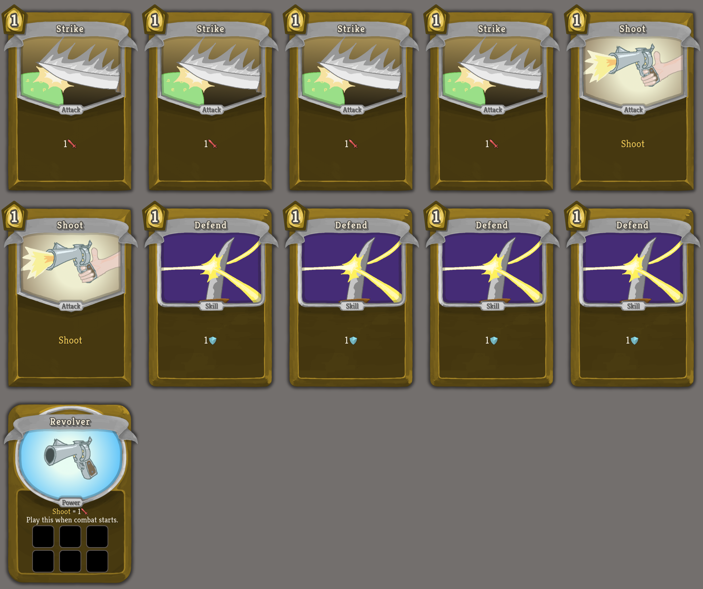
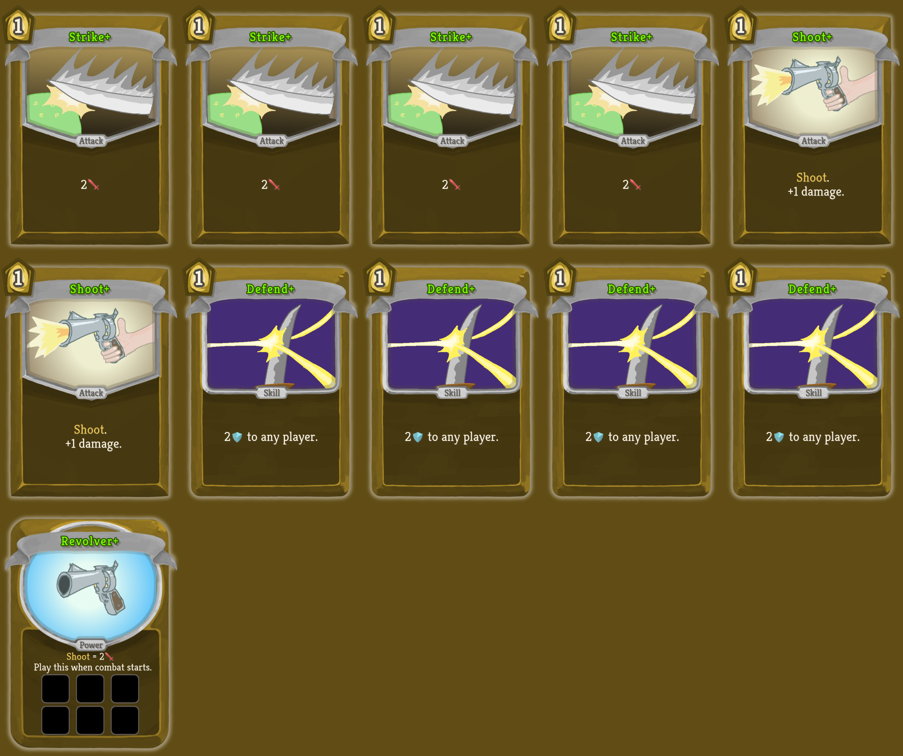

# sts-ttsgenerator (bladegunner example)

## Changes:

* Add cards definition at [bladegunner.json](src/main/resources/ttsgenerator/cards/bladegunner.json).
* Add card sets:
  * [bladegunnerbasic.json](src/main/resources/ttsgenerator/cardsets/bladegunnerbasic.json) - Start deck.
  * [bladegunnerreward.json](src/main/resources/ttsgenerator/cardsets/bladegunnerreward.json) - Reward deck.
  * [bladegunnergold.json](src/main/resources/ttsgenerator/cardsets/bladegunnergold.json) - Rare reward deck.
* Add images at [images](src/main/resources/ttsgenerator/images).

## Generated card set

